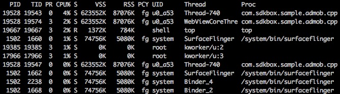

# 记一次android cpu使用率调试

有一次工作中,遇到cpu使用过高问题,我只是想简单地查看android手机上的cpu使用情况,这时其实可以用adb的shell命令联到andorid手机上来查看就行了

1. 运行 `adb shell`,进到手机上的shell
2. 运行 `top -m 10 -d 10 -t -s cpu` 来查看android手机上cpu的使用情况

我运行一个空工程, 然后查看cpu使用情况, 如图

可以看到 `com.htl.test` 这个包下有一个进程(18601), 这个进程中有两个线程 18617 和 18632

然后我运行了一个sample工程,再看手机上的cpu使用情况

可以看到 `com.sdkbox.sample.admob.cpp` 这个包下有一个进程(19528), 这个过程中有三个线程 19543 19574 19547,相比于空工程,多了一个线程 WebViewCoreThre (线程号为19574),而且可以看到它的cpu使用率在2%, 所以应该是在sample工程多启动了一个叫 WebViewCoreThre 的线程

PS. `top`的其它使用参数,可以运行 `top -h` 查看
PS. Android Studio中的cpu使用情况查看,真心不错,java代码的话,都可以统计到函数的调用时间图,太方便了. Android Moniter界面上就可以找到cpu的统计情况,如果只想简单些可以用上面的命令行`top`
