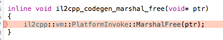

# Unity C++ plugin 插件库 crash

今天在调试一个c++ plugin, 结果在调一个函数时crash了, 如图

 

查看crash stack知道,应该是在释放c++中函数返回的char*时报错了.

查了资料后才知道,原来c++中返回char*给c#,要新专门分配一个字符空间,然后再把它返回出错,unity中的c++到c#的bridge会把这个空间释放掉的

```cpp
char* getString() {
	string s = "hugo";
	return strdup(s.c_str()); //需要用strdup返回一个新分配好的空间,unity中会帮你释放的
}
```
